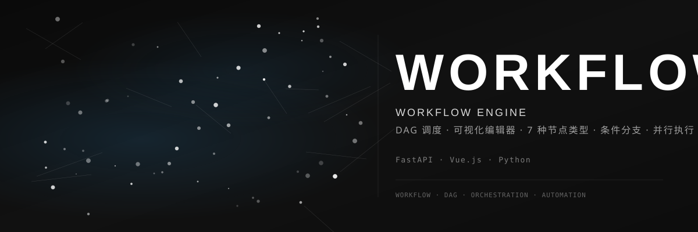

<div align="center">



<br>

### ⚙️ AI 工作流编排引擎

[](https://github.com/dirjaker/workflow_engine/stargazers)
[](https://github.com/dirjaker/workflow_engine/network/members)
[](https://github.com/dirjaker/workflow_engine/graphs/contributors)
[](https://github.com/dirjaker/workflow_engine/blob/dev/LICENSE)

</div>

---

## 📖 项目简介

一个可视化的 **AI 工作流编排引擎**，基于有向无环图（DAG）调度，支持 LLM 调用、条件分支、并行执行、错误重试等能力。通过拖拽式 Web 编辑器，让非技术人员也能轻松编排复杂的 AI 任务链。

---

## ✨ 功能特性

| 功能 | 描述 |
|------|------|
| 📊 **DAG 调度** | 基于拓扑排序的有向无环图任务依赖管理，同层节点自动并行执行 |
| 🎨 **可视化编辑器** | 内置 Web Canvas 编辑器，拖拽式工作流设计界面 |
| 🧩 **7 种节点** | 开始、结束、LLM、工具、条件、代码执行、数据转换 |
| 🔀 **条件分支** | 支持 Python 表达式和 LLM 判断两种条件类型 |
| ⚡ **并行执行** | 基于 asyncio 的并行调度，同层无依赖节点自动并发 |
| 🔄 **错误重试** | 节点级别可配置重试次数和重试延迟 |
| 📋 **执行历史** | 完整的执行记录持久化，支持节点级日志追踪 |
| 🖥️ **多端支持** | Web API 服务 + macOS 桌面应用（tkinter） |
| 🔒 **安全沙箱** | 代码执行节点采用 AST 级别安全沙箱，禁止危险操作 |

---

## 🚀 快速开始

```bash
# 克隆项目
git clone https://github.com/dirjaker/workflow_engine.git
cd workflow_engine

# 创建虚拟环境
conda create -n workflow_engine python=3.12 -y
conda activate workflow_engine

# 安装依赖
pip install -r requirements.txt

# 启动 Web 服务（默认端口 8001）
python api.py
```

启动后访问 `http://localhost:8001` 即可使用可视化编辑器。

---

## 🛠️ 技术栈

| 层级 | 技术 |
|------|------|
| **后端框架** | FastAPI + Uvicorn |
| **数据模型** | Pydantic v2 |
| **数据库** | SQLite |
| **前端** | 内嵌 Canvas 编辑器（原生 HTML/CSS/JS） |
| **调度引擎** | Python asyncio |
| **桌面应用** | tkinter（macOS） |
| **打包** | py2app |

---

## 📁 项目结构

```
workflow_engine/
├── api.py              # FastAPI 主入口 + 内嵌 Web UI
├── models.py           # Pydantic 数据模型（节点、边、工作流、执行记录）
├── dag_executor.py     # DAG 执行引擎核心（拓扑排序、并行调度、变量传递）
├── node_executors.py   # 7 种节点执行器实现
├── database.py         # SQLite 数据库管理
├── config.yaml         # 配置文件
├── requirements.txt    # Python 依赖
├── LICENSE             # MIT 许可证
├── assets/
│   └── banner.svg      # 项目 Banner
├── src/
│   ├── web/
│   │   ├── app.py      # Web Dashboard 独立入口
│   │   └── static/
│   │       └── index.html  # 独立 Dashboard 页面
│   └── macos/
│       └── app.py      # macOS 桌面应用
├── packaging/
│   └── py2app_setup.py # macOS 打包脚本
└── docs/
    ├── DEVELOPMENT.md  # 开发指南
    └── CHANGELOG.md    # 变更日志
```

---

## 🔌 API 接口

| 方法 | 路径 | 说明 |
|------|------|------|
| `GET` | `/api/health` | 健康检查 |
| `POST` | `/api/workflows` | 创建工作流 |
| `GET` | `/api/workflows` | 列出所有工作流 |
| `GET` | `/api/workflows/{id}` | 获取工作流详情 |
| `PUT` | `/api/workflows/{id}` | 更新工作流 |
| `DELETE` | `/api/workflows/{id}` | 删除工作流 |
| `POST` | `/api/workflows/{id}/run` | 同步执行工作流 |
| `POST` | `/api/workflows/{id}/run/stream` | 流式执行工作流（SSE） |
| `GET` | `/api/executions` | 列出执行记录 |
| `GET` | `/api/executions/{id}` | 获取执行详情 |
| `GET` | `/api/stats` | 获取统计信息 |
| `GET` | `/api/templates` | 列出内置模板 |
| `POST` | `/api/workflows/from-template/{name}` | 从模板创建工作流 |

---

## 🧩 节点类型

| 节点 | 类型 | 说明 |
|------|------|------|
| 🟢 开始 | `start` | 工作流入口，接收输入参数 |
| 🔴 结束 | `end` | 工作流出口，收集最终输出 |
| 🤖 LLM | `llm` | 调用大语言模型，支持 system/user prompt 和 JSON 输出 |
| 🔧 工具 | `tool` | 调用外部工具，支持参数插值 |
| ❓ 条件 | `condition` | 支持 Python 表达式和 LLM 判断两种路由方式 |
| 💻 代码 | `code` | 在安全沙箱中执行 Python 代码 |
| 🔄 转换 | `transform` | 数据转换和格式化 |

---

## 📝 开发日志

- [x] DAG 调度引擎
- [x] 可视化编辑器
- [x] 7 种节点类型
- [x] 条件分支（表达式 + LLM 判断）
- [x] 并行执行
- [x] 错误重试机制
- [x] 流式执行（SSE）
- [x] 内置工作流模板
- [x] macOS 桌面应用
- [ ] 定时触发器
- [ ] Webhook 触发
- [ ] 分布式执行
- [ ] 单元测试套件

---

## 📚 文档

- [开发指南](docs/DEVELOPMENT.md) — 环境搭建、架构说明、开发规范
- [变更日志](docs/CHANGELOG.md) — 版本变更历史
- [技术文档](docs/技术文档.md) — 详细技术设计文档
- [代码审查报告](REVIEW.md) — 安全扫描和代码质量分析

---

## 📄 许可证

[MIT License](LICENSE)

---

<div align="center">

🔗 **GitHub**: [dirjaker/workflow_engine](https://github.com/dirjaker/workflow_engine)

⭐ 如果这个项目对你有帮助，请给一个 Star 支持一下！

</div>
